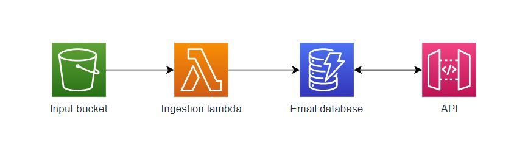

Filip Hagan @filiphagan
# AWS Simple Data Pipeline with Terraform
Exemplary e-mail database created from JSON files. When JSON is uploaded into S3 the ingestion Lambda is triggered, 
the file is verified and the information is recorded in DynamoDB. 

This DynamoDB is then exposed through the API Gateway for public queries. Here, simplified to return all the data from 
the database. 

### Architecture 
S3 bucket + Lambda + DynamoDB + API Gateway (+ CloudWatch) 


### Build
The infrastructure is defined in Terraform. I was using Terraform **1.0.7**. If you're not familiar with Terroform I'd 
suggest to take a quick [introductory course](https://www.youtube.com/watch?v=SLB_c_ayRMo) before moving forward. 
For AWS credentials I added TF_VAR_access_key and TF_VAR_secret_key to my local environment variables 
[(docs)](https://www.terraform.io/docs/cli/config/environment-variables.html#tf_var_name). Be aware that the iam policies 
included in JSONs have some hardcoded variables that have to be changed e.g. account number and resource names. <p>
Main infrastructure: **main.tf** <br>
Variable definitions: **vars.tf** <br>
Variable assignment: **terraform.tfvars** <p>
To deploy the infrastructure run:
```
terraform init
terraform apply
```

## 1. Ingestion Lambda
Code: **lambda_function.py**

### Invocation
To store new data in the chosen DynamoDB table the JSON files have to be uploaded to the dedicated 
S3 bucket. We can upload any file manually via AWS console:<br>
```
AWS console > S3 > bucket-name-defined-in-tfvars > Upload..
```

or by AWS CLI:
```
aws s3 cp ./local/directory s3://bucket-name-defined-in-tfvars --recursive
``` 
The lambda verifies the file content and sends the request to DynamoDB to save the data. 

### Monitoring
We are able to track the ingestion lambda workload on CloudWatch and monitor the amount of requests. 

### IAM lambda policy 
Available in **iam_policy_lambda.json** <br> 
Please update the account id and resource names based on **terraform.tfvars**

### Tests  
End-to-end integration tests were introduced to test the whole pipeline. 
JSON samples (/data-sample/*) contain several edge cases:
* 001-009.json: standard valid cases <p>
Other valid cases:
* 010.json: valid: uppercase key/values
* 011.json: valid: empty first_ and last_name
* 012.json: valid: email and last_name only <p>
Invalid cases:
* 013.json: first_name, email and unknown key
* 014.json: invalid email
* 015.json: invalid json structure
* 016.json: invalid email
* 017.json: no email


Records should appear in the DynamoDB table (name defined in tfvars). 

-----------------------------
## 2. DynamoDB REST endpoint

### Architecture
API Gateway + DynamoDB <p>
Simplest, straightforward architecture: the API is handling only GET method calling DynamoDB to execute 'Scan' operation.
'Scan' returns all elements from the predefined table.   

### IAM API policy 
Available in **iam_policy_api.json** Note: see lambda policy remarks. 

### Invocation
To invoke deployed API call
```
curl -X GET  https://<API_ID>.execute-api.<AWS_REGION>.amazonaws.com/dev/get-data
```
Exact API invoke URL is generated by Terraform and will appear in the console output after successful infrastructure 
deployment. Output example:
```
Apply complete! Resources: 19 added, 0 changed, 0 destroyed.

Outputs:

account_id = "632612304764"
api_invoke_url = "https://0p0qxx4yez.execute-api.eu-central-1.amazonaws.com/dev/get-data"
```
